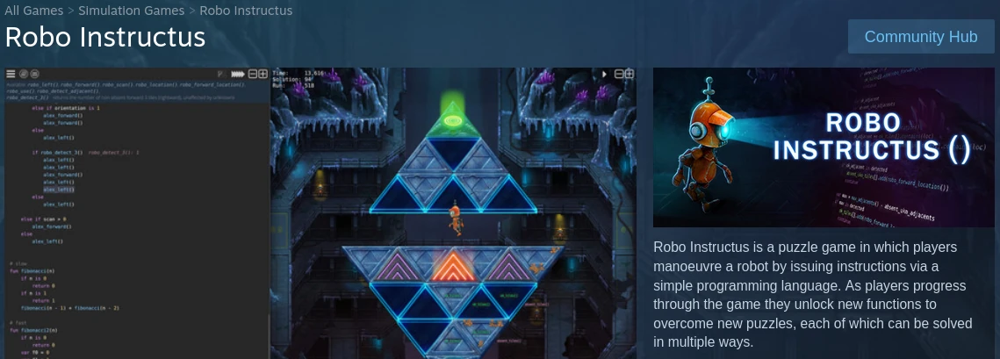

In 2017 I quit my job to make a PC programming puzzle game [**Robo Instructus**](https://www.roboinstruct.us).

One aspect in particular I worked on in some depth was **text rendering**. Robo Instructus has a lot of text & there just wasn't the libraries in the Rust ecosystem that could perform as I needed, particularly compiled in debug mode _(and I'm not waiting for rust --release compiles after each code change!)_.

So I took over maintenance of [rusttype](https://gitlab.redox-os.org/redox-os/rusttype) and fixed my issues with it & its "gpu cache" module. I eventually rewrote it as [ab-glyph](https://github.com/alexheretic/ab-glyph). With that as a base I also wrote the [glyph-brush](https://github.com/alexheretic/glyph-brush) crates which handle layout, clever caching and optimise the process of getting text strings into vertices pointing a subtextures on your GPU.

My open source libs allowed me to handle the profusion of text in my game, I've also seen them used in other rust game projects & engines which is nice! However, text rendering is surprisingly deep & complex so I've no doubt superior tools will appear in the rust ecosystem in time.

I wrote about some of my text rendering adventures on the game blog:
* [2018: Technical Look At Text Rendering In Robo Instructus](https://blog.roboinstruct.us/2018/05/18/technical-look-at-text-rendering-in-robo-instructus.html)
* [2018: Faster Screen Text Rendering](https://blog.roboinstruct.us/2018/05/25/technical-look-at-text-rendering-in-robo-instructus-ii.html)
* [2020: Otf Font Rendering or: How I Should Have Learned To Stop Worrying And Love The Ttf](https://blog.roboinstruct.us/2020/05/24/the-otf-journey.html)

You can read more over at [blog.roboinstruct.us](https://blog.roboinstruct.us). 
