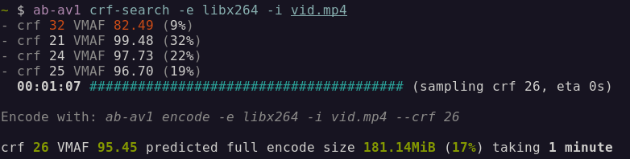
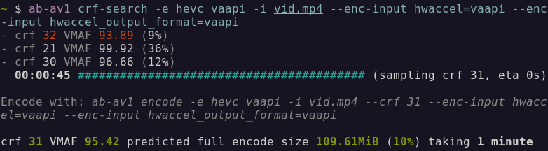
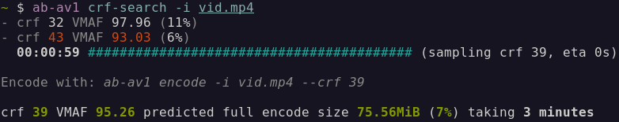

Since [posting about ab-av1](/posts/ab-av1) I've been improving the tool. v0.2.0 brought support for automatic key interval setting, arbitrary svt-av1 arguments, configurable vfilters & pixel format. Later in v0.3.0 I improved VMAF with automatic model selection & automatic upscaling to the selected model.

When I found myself wanting to encode in an older format (e.g. x264/x265) to target somewhere without as good av1 support, I really missed not being able to use ab-av1's _auto-encode_ / _crf-search_. So [**v0.4.0**](https://github.com/alexheretic/ab-av1/blob/main/CHANGELOG.md#v040) is now available has new option `--encoder`/`-e` which can override the default svt-av1 encoder to use any ffmpeg encoder instead.

This opens the doors to a world of fast crf searching & auto encoding with any video encoder you like.

## Examples
### x264
Lets take it for a spin with a high bitrate h264 1.1GB video re-encoding to a smaller size with at least 95 VMAF using good old **libx264**.

```sh
ab-av1 crf-search -e libx264 -i vid.mp4
```


So instead of using _SvtAv1EncApp_ to encode we'll call _ffmpeg_ instead with vcodec libx264. We can still do some of the nice things we do with the default encoder like set keyint (aka `-g` in ffmpeg) to 10s correctly depending on the input framerate.

### x265
How about **libx265** which should be more efficient.

```sh
ab-av1 crf-search -e libx265 -i vid.mp4
```


Yeah a pretty nice reduction in size, though encoding isn't quite as speedy as it's dad.

### VA-API
Since we can use anything that works with ffmpeg we can even try GPU accelerated encoding. My GPU supports h265 encoding. Though crf encoding isn't supported we can set the somewhat equivalent `-qp` quality which ab-av1 will automatically use for vaapi encoders.

```sh
ab-av1 crf-search -e hevc_vaapi -i vid.mp4 \
  --enc-input hwaccel=vaapi \
  --enc-input hwaccel_output_format=vaapi
```


It is very fast and doesn't use CPU. But not as flexible to use as the CPU encoders plus no way to configure the quality/speed trade off. It will be interesting to see GPU AV1 encoders!

### libaom-av1
_Still running..._

### Default: svt-av1
Finally we have the default encoder svt-av1. It now has a default preset of **8**.

```sh
ab-av1 crf-search -i vid.mp4
```


AV1 is great and using svt-av1 it's fast too, encoding faster than x265 with better compression.

## Final remarks
I was worried the code would get a bit muddled with the addition of configurable encoders, and indeed it does make things a little more complicated. In particular some of the argument & commands may not have the best names now, since an encoder may not even use "crf" or "preset". There is room for improvement perhaps, but with av1 support still not 100% everywhere I think this feature is more than worthwhile.

There are also vcodec specific tweaks we can make. I've already added some for vaapi codecs, libvpx-vp9 & libaom-av1 but I'm sure more can be added. Head over to the [ab-av1 repo](https://github.com/alexheretic/ab-av1) to raise a PR or issue if you have some ideas.
